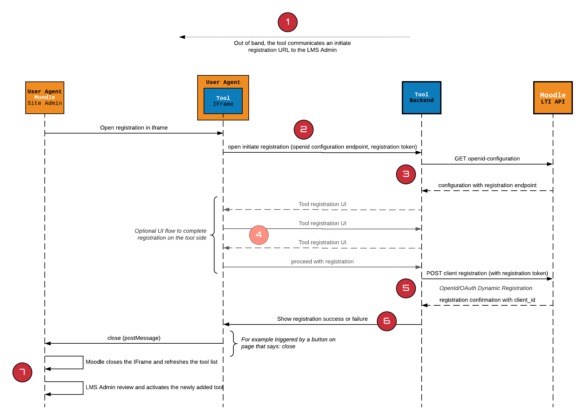

## Summary

LTI Advantage offers a more modern LTI integration to tools based on OpenId and OAuth2. Due to the asymmetric nature of LTI 1.3, the configuration has become a bit more difficult, including the copy/pasting of a significant amount of data on both sides, the platform and the tool.

The dynamic registration allows to automate this exchange of information, allowing LMS administrators to once again use a single URL to initiate a registration. Like the core LTI 1.3 specification, the Dynamic Registration leverages existing specifications: the OpenID Discovery and OpenID Dynamic Registration that it profiles for the case of an LTI Tool registration. This implementation is under consideration by IMS Global under the LTI Advantage Dynamic Registration specifcation proposal. Visit the [IMS Global website](https://imsglobal.org) to access the actual specification.

The dynamic registration is currently only available for site level tool registration.

This document will cover how to implement that flow for a tool provider.

An update to this feature currently [under development](https://tracker.moodle.org/browse/MDL-70500) allows the dynamic registration to also be used to update an already existing tool, for example to update in place an LTI 1.1 tool. This can be useful in particular if the tool is used in many courses and has many associated links.

## The flow in a nutshell



1. The tool provider sends to the LMS Admin a registration URL. That URL may be a one time usage only URL (i.e. tailored for a specifc LMS account registration).
2. The tool then receives a registration request to that URL with 2 additional parameters added to the request:
  * `openid_configuration`
  * `registration_token`
3. The tool retrieves and verifies the platform configuration data
4. The tool then displays any user interface needed to complete the registration; it might be just a simple confirmation, up to actually asking the user to authenticate on the tool side to acknowledge which account will be registered.
5. If the user agrees to complete the registration on the tool side, the tool uses the registration endpoint and the token to post a tool registration request. If successful, Moodle returns the actual client registration including both the client_id and the lti_deployment_id
6. The tool can then expose a close button. The close button uses the windows.postMessage to indicate to moodle that registration operation is done (that it went through or not).
7. Moodle then refreshes the list of tools. A tool is always registered as pending. The administrator must then review the tool and activate it. The administrator may apply changes at any time.


## The Update flow (MDL-70500)

When starting the registration flow, before to launch the registration URL, Moodle will check if the registration URL's domain matches any of the currently installed site tools. If it does, it will instead prompt the user to choose to use the dynamic registration to either update one of the tool or carry on creating a new site tool.

For the tool implementation, there is no difference in the registration flow itslef. However a tool may request to the Moodle site the current registration of the tool. If a value is returned, it means the tool is already registered (LTI 1.0 or above) and the tool may use this information to lookup for which 'account' this re-registration request is made.

For example, a tool may use this information to know the registration request has been issued by the Example institution as identified by its 1.1 consumer key/secret (see below) and the tool will then proceed to update the Example institution account with the LTI 1.3 configuration exposed by the moodle site and request a registration for that specific account.
## In more Details

### The registration initiation request

The registration request is a URL given by the tool that will be launched in the 1st leg of the registration process. The request will open in an IFrame, but a tool may decide to break in a new window if the registration flow involves significant UI or a login flow that depends on cookies.

The request will contain the following attributes:

* `openid_configuration`: the url to retrieve the LMS configuration, exposing the openid and the registration endpoint.
* `registration_token`: a token to use by the tool when posting the request for registration. That token has a 1 hour validity and can only be used to register a single tool.

### Getting the Moodle Openid configuration

The `openid_configuration` exposes an unprotected endpoint to get the Moodle site LTI OpenId configuration. The configuration is a JSON document following the format specified by the OpenId Discovery specification, adding an additional claim around LTI to expose the LMS type, version and supported messages and variables.

The key element for a tool to grab from the openid-configuration are:

* `issuer`: the issuer domain must match the openid-configuration URL domain; a tool should not proceed if there is a mismatch.
* `token_endpoint`: url to get an access token
* `jwks_uri`: the endpoint to get the public keys of this moodle site
* `authorization_endpoint`: the url to send the OpenId authentication request
* `registration_endpoint`: the url to send the tool registration request

You may also be interested in:

* `scopes_supported`: the supported services available on this instance. Future version of moodle will expose new services and thus additional scopes.
* `https://purl.imsglobal.org/spec/lti-platform-configuration`: contains information about that moodle version, the messages and variables supported. Future versions of Moodle will add new message types and variable support.

Additional claims may be included in the configuration, a tool should just ignore any claims it does not need/support.

Here is an example of a full platform configuration:

```json
{
  "issuer": "https://moodle.zeedeeyou.com",
  "token_endpoint": "https://moodle.zeedeeyou.com/mod/lti/token.php",
  "token_endpoint_auth_methods_supported": [
    "private_key_jwt"
  ],
  "token_endpoint_auth_signing_alg_values_supported": [
    "RS256"
  ],
  "jwks_uri": "https://moodle.zeedeeyou.com/mod/lti/certs.php",
  "authorization_endpoint": "https://moodle.zeedeeyou.com/mod/lti/auth.php",
  "registration_endpoint": "https://moodle.zeedeeyou.com/mod/lti/openid-registration.php",
  "scopes_supported": [
    "https://purl.imsglobal.org/spec/lti-bo/scope/basicoutcome",
    "https://purl.imsglobal.org/spec/lti-ags/scope/lineitem.readonly",
    "https://purl.imsglobal.org/spec/lti-ags/scope/result.readonly",
    "https://purl.imsglobal.org/spec/lti-ags/scope/score",
    "https://purl.imsglobal.org/spec/lti-ags/scope/lineitem",
    "https://purl.imsglobal.org/spec/lti-nrps/scope/contextmembership.readonly",
    "https://purl.imsglobal.org/spec/lti-ts/scope/toolsetting",
    "openid"
  ],
  "response_types_supported": ["id_token"],
  "subject_types_supported": ["public","pairwise"],
  "id_token_signing_alg_values_supported": ["RS256"],
  "claims_supported": ["sub","iss","name","given_name","family_name","email"],
  "https://purl.imsglobal.org/spec/lti-platform-configuration": {
    "product_family_code": "moodle",
    "version": "4.0dev (Build: 20201028)",
    "messages_supported": [
      "LtiResourceLink",
      "LtiDeepLinkingRequest"
    ],
    "variables": [
      "Context.id.history",
      "BasicOutcome.url",
      "Moodle.Person.userGroupIds"
    ]
  }
}
```

## Requesting current registration (MDL-70500)

With MDL-70500, a tool may issue a GET request to the registration end point with the token as the Bearer token. If the tool is already registered, Moodle will return the current registration. The registration value will depend on whether or not the current registration is already an LTI 1.3 tool or not.

The response can then be:

* `404` if the tool is not already registered (it's therefore a new regisitration)
* LTI 1.3 Client Registration including the current `client_id` and `lti_deployment_id`, same as the response from the registration request.
* LTI 1.x or 2.x Client profile

The LTI 1.x or 2.x Client profile differ from the LTI 1.3 one in that they don't contain the LTI 1.3 Open Id related informations. They do contain however the LTI Information. They also contain the current OAuth Credentials signed with the OAuth secret in the LTI Information section allowing the tool to automate the migration.

The properties of the `oauth_consumer` are:

* key: the LTI 1.x consumer key or LTI 2.x Tool Proxy GUID
* nonce: a nonce value
* A signature computed as follow `hash(sha256, concat(key, secret, nonce))`

The example below the secret used is `robohasnosecret`:

```json
{
   "client_name":"Robotest",
   "scope":"https://purl.imsglobal.org/spec/lti-ags/scope/score https://purl.imsglobal.org/spec/lti-ags/scope/result.readonly https://purl.imsglobal.org/spec/lti-ags/scope/lineitem.readonly https://purl.imsglobal.org/spec/lti-ags/scope/lineitem https://purl.imsglobal.org/spec/lti-nrps/scope/contextmembership.readonly",
   "https://purl.imsglobal.org/spec/lti-tool-configuration":{
      "version":"LTI-1p0",
      "oauth_consumer":{
         "key":"robotest-11",
         "nonce":"EgJ44paAsX",
         "sign":"0c16e3436382a60c17bceb77e93af8536a52ec08a3fa3a70250bd0b8ed75fb4e"
      },
      "deployment_id":"128",
      "target_link_uri":"https://robotest.theedtech.dev",
      "domain":"robotest.theedtech.dev",
      "description":"Less clicks, more tests, this is the LTI Robotest!",
      "messages":[
         {
            "type":"LtiDeepLinkingRequest",
            "target_link_uri":"https://robotest.theedtech.dev"
         }
      ],
      "custom_parameters":{
         "context_id_history":"$Context.id.history"
      },
      "claims":[
         "sub",
         "iss",
         "name",
         "family_name",
         "given_name"
      ]
   }
}
```

The tool should use the signature to verify the migration request does come from the platform where the tool is actually registered.

## Registering your tool

Once you are ready to register, you use the registration end point provided in the request to post a Tool Registration JSON document. This is an API call. The request needs to include the registration token as Bearer token in the Authorization Header.

If successful, Moodle will echo the actual registration in moodle with the client_id and lti_deployment_id. This concludes the registration and the UI can be redirected to a registration completed page.

The tool definition follows the OpenId Dynamic Registration with a few constraints and additions:

Tool must provide:

* `client_name`: Your tool name
* `initiate_login_uri`: the OpenId initiation URI
* `redirect_uris`: a JSON Array of all the redirect URIs. No templating. No partial paths. To be valid, it must be an exact match with the redirect URI passed in the OpenId Authentication Request.
* `jwks_uri`: your public keyset URL. Moodle does not support public key in the dynamic registration flow.
* `scope`: comma separated list of scopes you would like enabled. This will drive which services are made available to your tool in the Services section of the tool definition.

To enable LTI Assignment and Grade Services, include the following scopes:

Without column management:

* `https://purl.imsglobal.org/spec/lti-ags/scope/score` 
* `https://purl.imsglobal.org/spec/lti-ags/scope/result.readonly`

With column management, also require:

* `https://purl.imsglobal.org/spec/lti-ags/scope/lineitem.readonly` 
* `https://purl.imsglobal.org/spec/lti-ags/scope/lineitem`

To enable membership service, require this scope:

* `https://purl.imsglobal.org/spec/lti-nrps/scope/contextmembership.readonly`

The tool must include the extension claim for LTI data: `https://purl.imsglobal.org/spec/lti-tool-configuration`

It needs to contain:

*`domain`: domain of your tool
* `target_link_uri`: will be used as the Tool URL 
* `claims`: include any of  name, given_name, family_name to set Always for sending the user’s name, include email to set to Always for sending the user’s email. Note that the Moodle admin can change those at any time. Empty if you don't need any user information if you don't need user info (well done!)
* `messages`: with 3.10 the only message that is supported is Deep Linking. Tool should usually support that message type. By including it, it will check the deep linking support in Moodle. You may provide a distinct URL for it (remember that in LTI 1.3 those URLs are just passed to you as `target_link_uri` and never launched it directly by Moodle).

```json
POST <registrationendpoint>
Authorization: Bearer <registration_token>
Content-Type: application/json
{
  "application_type": "web",
  "response_types": [
    "id_token"
  ],
  "grant_types": [
    "implicit",
    "client_credentials"
  ],
  "initiate_login_uri": "https://robotest.theedtech.dev/oidc/init?dynreg=true",
  "redirect_uris": [
    "https://robotest.theedtech.dev/oidc/launch"
  ],
  "client_name": "Robotest",
  "jwks_uri": "https://robotest.theedtech.dev/.well-known/jwks.json",
  "token_endpoint_auth_method": "private_key_jwt",
  "https://purl.imsglobal.org/spec/lti-tool-configuration": {
    "domain": "robotest.theedtech.dev",
    "target_link_uri": "https://robotest.theedtech.dev",
    "custom_parameters": {
      "context_id_history": "$Context.id.history",
      "context_start_date": "$CourseSection.timeFrame.begin",
      "context_end_date": "$CourseSection.timeFrame.end",
      "resource_link_history": "$ResourceLink.id.history",
      "resource_available_start": "$ResourceLink.available.startDateTime",
      "resource_available_end": "$ResourceLink.available.endDateTime",
      "resource_submission_start": "$ResourceLink.submission.startDateTime",
      "resource_submission_end": "$ResourceLink.submission.endDateTime"
    },
    "claims": ["iss", "sub","name", "given_name", "family_name"],
    "messages": [
      {
        "type": "LtiDeepLinkingRequest",
        "target_link_uri": "https://robotest.theedtech.dev",
        "label": "Add Robotest",
      }
    ],
    "description": "Less clicks, more tests, this is the LTI Robotest!"
  },
  "scope": "https://purl.imsglobal.org/spec/lti-ags/scope/lineitem https://purl.imsglobal.org/spec/lti-ags/scope/result.readonly https://purl.imsglobal.org/spec/lti-ags/scope/score https://purl.imsglobal.org/spec/lti-nrps/scope/contextmembership.readonly",
  "logo_uri": "https://robotest.theedtech.dev/assets/robotest_logo.png"
}

201 OK
{
  "client_id": "fYQt5KS4vCinujE",
  "token_endpoint_auth_method": "private_key_jwt",
  "response_types": [
    "id_token"
  ],
  "jwks_uri": "https://robotest.theedtech.dev/.well-known/jwks.json",
  "initiate_login_uri": "https://robotest.theedtech.dev/oidc/init?dynreg=true",
  "grant_types": [
    "client_credentials",
    "implicit"
  ],
  "redirect_uris": [
    "https://robotest.theedtech.dev/oidc/launch"
  ],
  "application_type": [
    "web"
  ],
  "client_name": "Robotest",
  "logo_uri": "https://robotest.theedtech.dev/assets/robotest_logo.png",
  "scope": "https://purl.imsglobal.org/spec/lti-ags/scope/score https://purl.imsglobal.org/spec/lti-ags/scope/result.readonly https://purl.imsglobal.org/spec/lti-ags/scope/lineitem.readonly https://purl.imsglobal.org/spec/lti-ags/scope/lineitem https://purl.imsglobal.org/spec/lti-nrps/scope/contextmembership.readonly",
  "https://purl.imsglobal.org/spec/lti-tool-configuration": {
    "deployment_id": "119",
    "target_link_uri": "https://robotest.theedtech.dev",
    "domain": "robotest.theedtech.dev",
    "description": "Less clicks, more tests, this is the LTI Robotest!",
    "messages": [
      {
        "type": "LtiDeepLinkingRequest",
        "target_link_uri": "https://robotest.theedtech.dev"
      }
    ],
    "custom_parameters": {
      "context_id_history": "$Context.id.history",
      "context_start_date": "$CourseSection.timeFrame.begin",
      "context_end_date": "$CourseSection.timeFrame.end",
      "resource_link_history": "$ResourceLink.id.history",
      "resource_available_start": "$ResourceLink.available.startDateTime",
      "resource_available_end": "$ResourceLink.available.endDateTime",
      "resource_submission_start": "$ResourceLink.submission.startDateTime",
      "resource_submission_end": "$ResourceLink.submission.endDateTime"
    },
    "claims": [
      "sub",
      "iss",
      "name",
      "family_name",
      "middle_name",
      "email"
    ]
  }
}

```

### Close registration

To close the registration panel, either on success or failure, you need to send a Windows Post Message to the Moodle parent window.

```javascript
(window.opener || window.parent).postMessage({subject:'org.imsglobal.lti.close'}, '*');
```

This will close the panel and refresh the list of tools. Your tool if successful will be added in a Pending State. The administrator can then review it, may change some attributes, and finally activate it.

That last bit is important: the dynamic registration is a way to initiate the tool configuration, not a contract. After registration it is in no way different from a tool that was manually configured. The tool configuration that was echo-ed during registration just illustrated the state of the tool before the actual review, the admin can apply changes at any time. As a tool, you should always expect that you will not get what seemed originally granted. For example you may have asked for email, but ended up not getting it.

